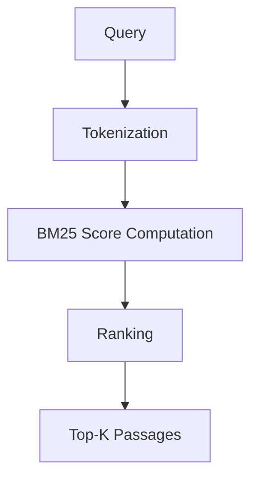

# MS MARCO Generative Question Answering System

This project implements a **retrieval-based question answering pipeline** using the **MS MARCO dataset**.

The system follows a **retrieve-then-generate architecture**, where relevant passages are first retrieved from a large corpus before generating answers.

The project progressively builds a full QA system through multiple stages:

1. Dataset exploration
2. Lexical retrieval (BM25)
3. Dense retrieval (Sentence-BERT)
4. Retrieval-Augmented Generation (RAG)

---

# Project Overview

The system architecture follows a typical **open-domain QA pipeline**.


---

# Repository Structure

```
msmarco-genqa
│
├── notebooks
│   ├── week01_eda.ipynb
│   └── week02_retrieval.ipynb
│
├── src
│   └── bm25_retriever.py
│
├── reports
│   ├── week01_dataset_analysis.md
│   └── week02_retrieval_report.md
│
└── README.md
```

---

# Dataset

The project uses the **MS MARCO v2.1 dataset**, a large-scale dataset introduced by Microsoft for machine reading comprehension and information retrieval research.

The dataset consists of real anonymized Bing search queries.

Each example contains:

* query
* answers
* candidate passages
* relevance labels

Dataset statistics:

| Split      | Queries |
| ---------- | ------- |
| Train      | ~808k   |
| Validation | ~101k   |
| Test       | ~101k   |

---

# Week 1: Dataset Exploration

During Week 1, we performed **exploratory data analysis (EDA)** on the MS MARCO dataset.

Tasks completed:

* Dataset loading
* Query length analysis
* Passage length distribution
* Dataset statistics exploration

Example insights:

| Statistic              | Observation  |
| ---------------------- | ------------ |
| Average query length   | ~5 words     |
| Typical passage length | 40–80 words  |
| Query distribution     | Right-skewed |

These observations help guide retrieval model design.

---

# Week 2: BM25 Retrieval Baseline

In Week 2, we implemented a **BM25 retrieval model** to establish a baseline retrieval system.

Pipeline:

1. Construct passage corpus
2. Tokenize passages
3. Build BM25 index
4. Retrieve top-k passages
5. Evaluate retrieval performance

Retrieval workflow:



---

# Retrieval Results

The BM25 baseline was evaluated using **MRR@10 (Mean Reciprocal Rank)**.

| Model         | MRR@10     |
| ------------- | ---------- |
| BM25 Baseline | **0.2716** |

This result is consistent with typical lexical retrieval baselines on MS MARCO.

---

# Future Work

The project will be extended with neural retrieval models and generative QA.

### Week 3 – Dense Retrieval

* Sentence-BERT embeddings
* Vector similarity search
* Semantic retrieval

### Week 4 – Retrieval-Augmented Generation

* Retrieve relevant passages
* Use retrieved context for answer generation
* Integrate with LLMs

---

# Technologies

The project uses the following technologies:

* Python
* PyTorch
* HuggingFace Datasets
* Rank-BM25
* NumPy

---

# Author

Gioia Zheng
