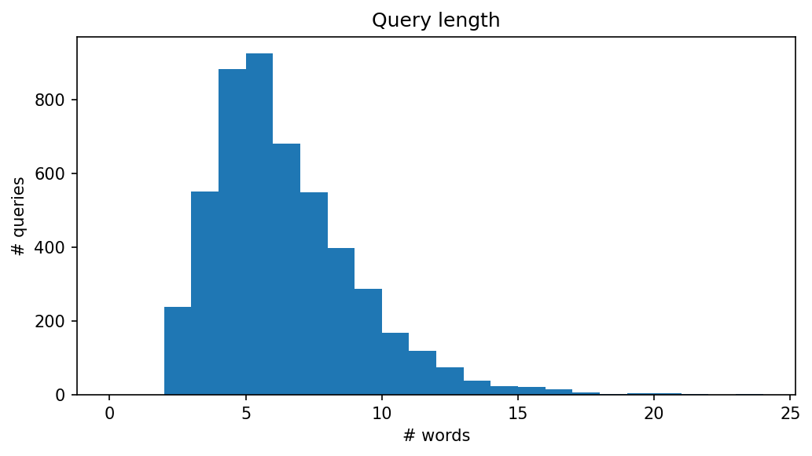
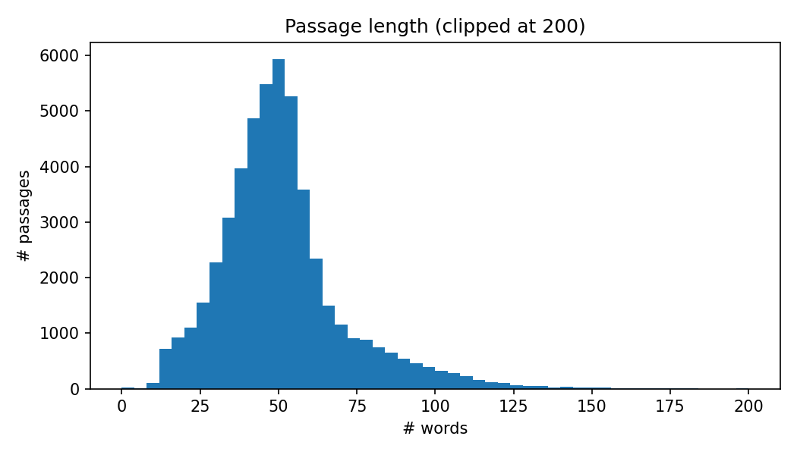
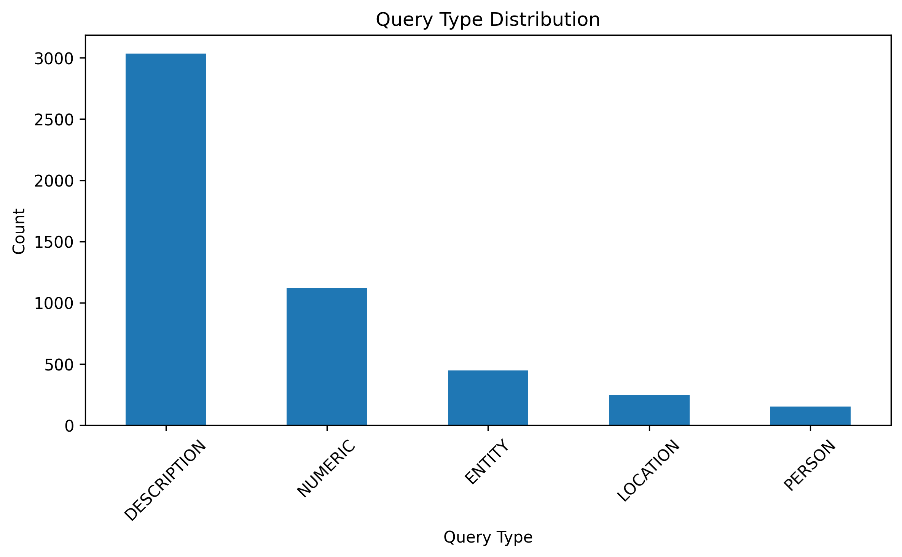
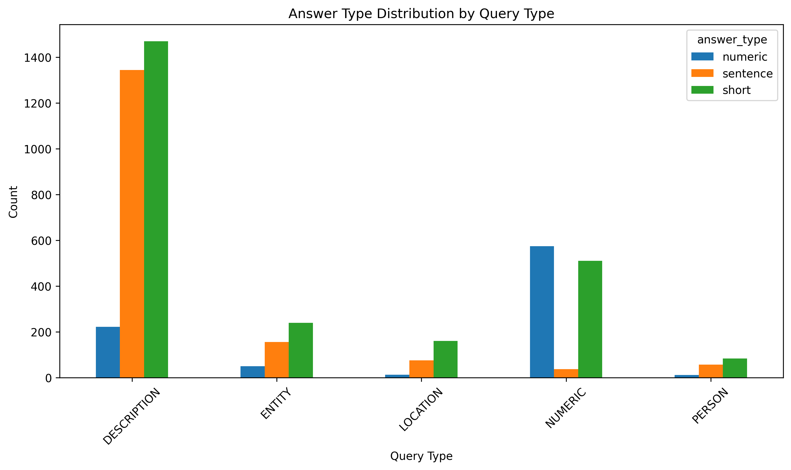

# Week 1: EDA on MS MARCO

*Auto-generated {{generated_at}}. Re-run
`python -m src.reporting.build_report --week week01` to refresh; the
figures themselves are produced by `notebooks/week01_eda.ipynb`
(`python -m nbconvert --to notebook --execute --inplace notebooks/week01_eda.ipynb`).*

## 1. Objective

Sized the dataset enough to make sampling decisions for later weeks.
Specifically: how long are queries? How long are passages? What kinds of
queries does MS MARCO have, and what kinds of answers do they get?

## 2. Dataset

- **Source**: HuggingFace `ms_marco` v2.1, **validation** split
  (101k queries) — chosen instead of `train` to keep the download light.
- **Sample**: first 5,000 rows of validation, deterministic.
- **Note**: this is the *QA* flavour of MS MARCO (queries + 10 candidate
  passages per query + a human-written answer + a `query_type` label).
  The Week 2 retrieval baseline uses the *Passage Ranking* corpus
  (8.8M passages, separate dataset).

## 3. Findings

### 3.1 Query length

Most queries are short (5–10 words). The long tail beyond ~15 words is small.

### 3.2 Passage length

Passages are roughly 10× longer than queries (median ~50 words). Some
passages are truncated to a single sentence — likely an artefact of the
MS MARCO snippet extraction.

### 3.3 Query types

`DESCRIPTION` and `NUMERIC` are the most common. `LOCATION` and `PERSON`
are smaller buckets. The label is a noisy heuristic, not a clean
taxonomy.

### 3.4 Answer types per query type

`DESCRIPTION` queries skew toward long answers; `NUMERIC` queries skew
toward short / single-word. A meaningful fraction across all buckets is
"no_answer" or empty, which we filter out before any supervision.

## 4. Implications for later weeks

- **Short queries → BM25 is reasonable as a first-stage retriever**
  (small vocab, lots of lexical signal). Confirmed by the Week 2 baseline.
- **Passage lengths < model context** (T5-small max input 512 tokens) →
  we can fit ~3 passages in the RAG generator's prompt without
  per-passage truncation in the common case.
- **`no_answer` and empty answers are common** → must be filtered for any
  fine-tuning supervision, otherwise the model learns to refuse.

## 5. Limitations

- 5k-row sample of the validation split. Exact percentiles will differ
  if you swap to `train` or to the full validation split.
- `query_type` is a coarse, noisy label. Not a basis for stratified
  evaluation on its own.
- HuggingFace `ms_marco` v2.1 is the QA flavour; the figures here say
  little about the *retrieval* corpus, which is shaped differently.

## 6. Next

- Week 2: BM25 retrieval baseline on the official Passage Ranking corpus.
- Week 3: RAG generation conditioned on Week 2 retrievals.
